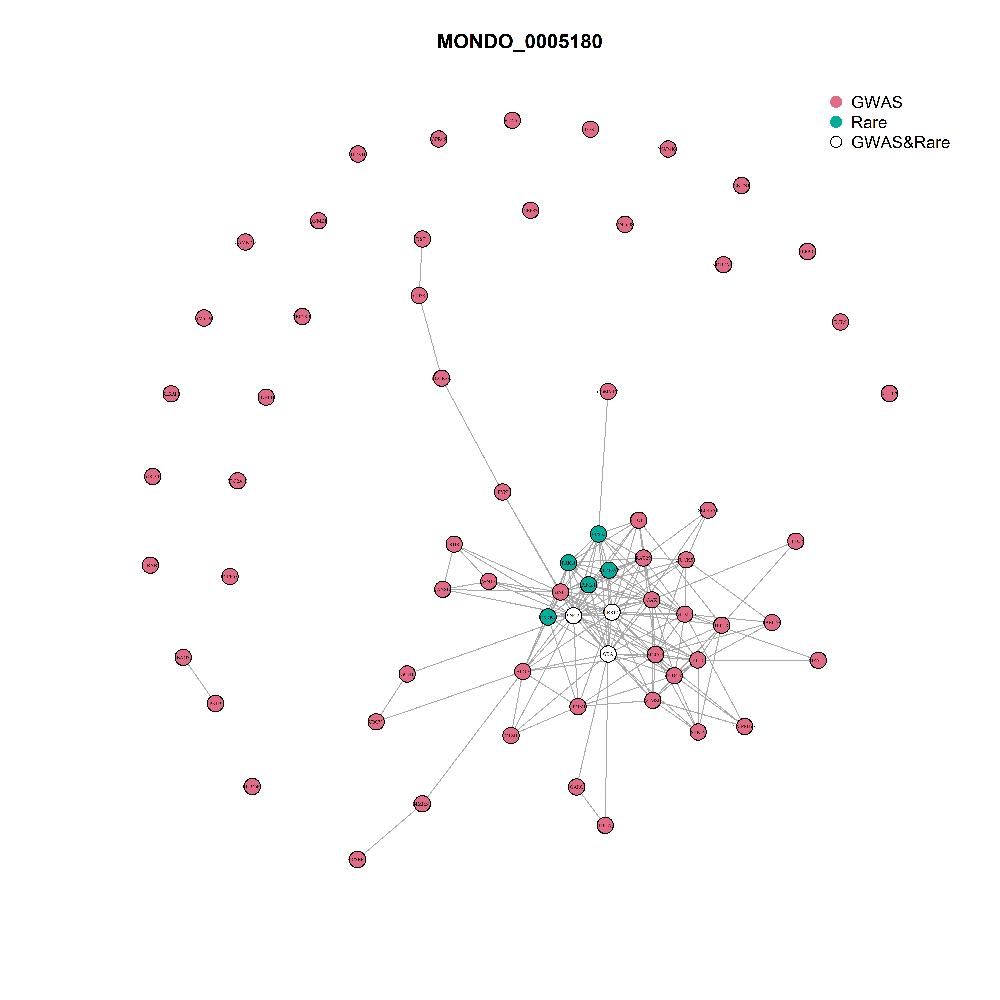
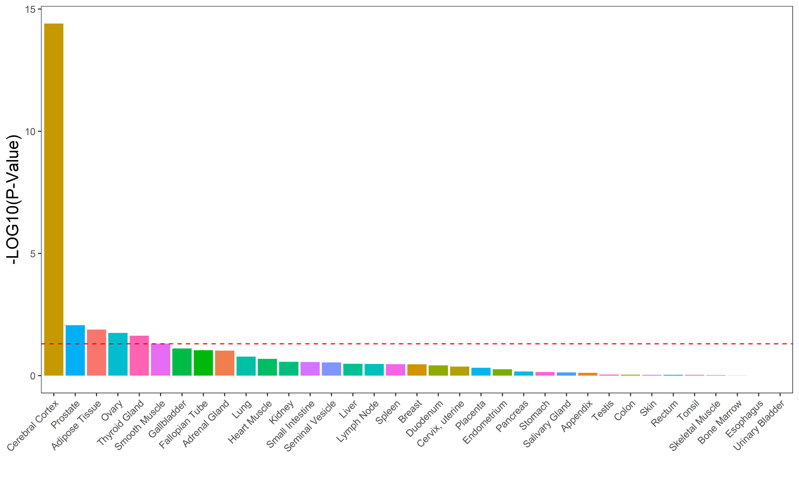
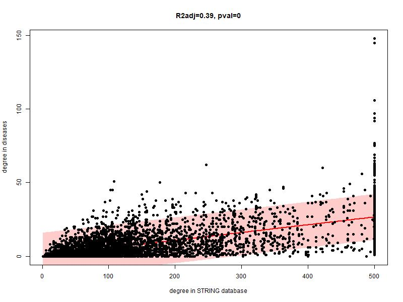

# A network medicine framework for positioning Myalgic Encephalomyelitis/Chronic Fatigue Syndrome (ME/CFS) within the human disease landscape

## Abstract

Understanding where ME/CFS sits among common diseases is a key step toward understanding its pathological mechanisms. CompareME is an R-based pipeline that constructs protein–protein interaction (PPI) networks for approximately 28 common diseases (including neurological, psychiatric, metabolic, cardiovascular, inflammatory, and autoimmune conditions) and compares them using three orthogonal similarity metrics: gene-level overlap (Jaccard index), functional enrichment correlation (ORA correlation), and network topology (network separation, SAB). A composite similarity score is then generated by similarity network fusion (SNF) and used as a distance in hierarchical clustering using several linkages. The Adjusted Rand Index was calculated against the ICD-10 disease classifications for each unsupervised clustering to select the best linkage. 

For each disease, candidate genes are retrieved from two evidence streams: GWAS credible sets (via the Open Targets platform, Locus-to-Gene scoring) and rare-variant studies (ClinGen curated genes and gene-burden tests). For ME/CFS specifically, a custom gene module is constructed by merging gene lists from two recent papers, one based on permutation analysis of DecodeME data (16,000 cases), the other on WGS-based rare variant prioritisation on 400 ME/CFS patients. 

This machine learning algorithm classifies ME/CFS in the same cluster as Obesity, Alzheimer's disease, Sleep Disorders, and Diabetes Mellitus. It also suggests that ME/CFS does not belong to the cluster of psychiatric diseases, nor is it an inflammatory/autoimmune condition. 

## Methods

### Data source

I selected 28 common diseases, including neurological, psychiatric, metabolic, cardiovascular, inflammatory, and autoimmune conditions. The complete list, with full names, abbreviations, and identifiers (EFO or MONDO codes), is in Table 1. The list of diseases is passed to the script through [mydiseases.yml](main/mydiseases.yml). ME/CFS is handled separately (see below). The classification according to ICD-10 v.2019 was manually retrieved from the official website ([ICD-10 2019](https://icd.who.int/browse10/2019/en)). 

| Disease Full Name                        | Abbreviation | ID            | ICD-10 Code | ICD-10 Category                                              |
| ---------------------------------------- | ------------ | ------------- | ----------- | ------------------------------------------------------------ |
| Alzheimer disease                        | AD           | MONDO_0004975 | G30         | Diseases of the nervous system                               |
| Anxiety disorder                         | ANX          | EFO_0006788   | F41         | Mental and behavioural disorders                             |
| Arteriosclerosis disorder                | AS           | MONDO_0002277 | I70         | Diseases of the circulatory system                           |
| Asthma                                   | ASMA         | MONDO_0004979 | J45         | Diseases of the respiratory system                           |
| Attention deficit hyperactivity disorder | ADHD         | EFO_0003888   | F90         | Mental and behavioural disorders                             |
| Bipolar Disorder                         | BD           | MONDO_0004985 | F31         | Mental and behavioural disorders                             |
| Blood coagulation disease                | BCD          | EFO_0009314   | D65         | Diseases of the blood and blood-forming organs               |
| Chronic Fatigue Syndrome                 | CFS          | EFO_0004540   | G93.3       | Diseases of the nervous system                               |
| Chronic obstructive pulmonary disease    | COPD         | EFO_0000341   | J44         | Diseases of the respiratory system                           |
| Crohn disease                            | CD           | EFO_0000384   | K50         | Diseases of the digestive system                             |
| Depressive Disorder                      | DD           | MONDO_0002050 | F32         | Mental and behavioural disorders                             |
| Diabetes Mellitus                        | DM           | EFO_0000400   | E11         | Endocrine, nutritional and metabolic diseases                |
| Epilepsy                                 | EPI          | EFO_0000474   | G40         | Diseases of the nervous system                               |
| Heart failure                            | HF           | EFO_0003144   | I50         | Diseases of the circulatory system                           |
| Hypercholesterolemia                     | HC           | HP_0003124    | E78         | Endocrine, nutritional and metabolic diseases                |
| Hypertension                             | HTN          | EFO_0000537   | I10         | Diseases of the circulatory system                           |
| Lupus erythematosus                      | SLE          | MONDO_0004670 | M32         | Diseases of the musculoskeletal system and connective tissue |
| Metabolic syndrome                       | MetS         | EFO_0000195   | E88.8       | Endocrine, nutritional and metabolic diseases                |
| Multiple Sclerosis                       | MS           | MONDO_0005301 | G35         | Diseases of the nervous system                               |
| Obesity                                  | OB           | EFO_0001073   | E66         | Endocrine, nutritional and metabolic diseases                |
| Parkinson                                | PD           | MONDO_0005180 | G20         | Diseases of the nervous system                               |
| Psoriasis                                | PSO          | EFO_0000676   | L40         | Diseases of the skin and subcutaneous tissue                 |
| Post-traumatic stress disorder           | PTSD         | EFO_0001358   | F43.1       | Mental and behavioural disorders                             |
| Rheumatoid arthritis                     | RA           | EFO_0000685   | M05         | Diseases of the musculoskeletal system and connective tissue |
| Schizophrenia                            | SCZ          | MONDO_0005090 | F20         | Mental and behavioural disorders                             |
| Sleep Disorder                           | SD           | EFO_0008568   | G47         | Diseases of the nervous system                               |
| Ulcerative colitis                       | UlCo         | EFO_0000729   | K51         | Diseases of the digestive system                             |
| Vasculitis                               | VAS          | EFO_0006803   | M30         | Diseases of the musculoskeletal system and connective tissue |

  <em>Table 1. Diseases included in the present study, in alphabetical order, with ICD-10 classification and codes. </em>

For each disease except ME/CFS, the function `Targets4Disease()` queries the Open Targets GraphQL API (v4). Gene–disease associations are collected from multiple evidence sources, including genome-wide association studies (GWAS),  ClinGen curated rare-variant evidence, and gene burden studies from sequencing data. Only genes meeting predefined evidence thresholds are retained. The default filtering parameters include:

| Parameter | Description | Default |
|---|---|---|
| L2G cutoff | minimum locus-to-gene score | 0.5 |
| ClinGen cutoff | minimum ClinGen evidence score | 0.5 |
| GeneBurden cutoff | minimum gene-burden score | 0.5 |
| Sample cutoff | minimum GWAS sample size | 0 |

  <em>Table 2. Sources of the genes used to build the disease module of ME/CFS. </em>

For each disease, the pipeline retrieves associated genes using a programmatic query to the Open Targets platform. Each gene is assigned a list label (`GWAS`, `Rare`, or `GWAS/Rare`) and annotated with its STRING preferred name (via the STRING API) and its NCBI Entrez ID (via a local copy of `gene_info.gz`). For myalgic encephalomyelitis/chronic fatigue syndrome (ME/CFS), I built a custom disease module based on the results of the studies in Table 3. 

| Number of cases | Sequencing Method | Gene-Mapping Method    | Genes | Criteria | Reference |
|----------------:|:------------------|:-----------------------|---------|:---------|:----------|
|464              |WGS                | Deep Learning          | 115 | ICC-IOM  |([Zhang S 2025](https://pmc.ncbi.nlm.nih.gov/articles/PMC12047926/))|
|14767            |Axiom UKB array    | Combinatorial analysis | 259 | CCC-IOM  |([Sardell JM 2025](https://www.medrxiv.org/content/10.64898/2025.12.01.25341362v1))|

  <em>Table 3. Sources of the genes used to build the disease module of ME/CFS. </em>

### PPI network construction

The STRING v12.0 human PPI database (`9606.protein.links.v12.0`) is downloaded automatically on first run and filtered to interactions with a combined score ≥ 0.4 (configurable via `STRING.co`). For each disease, `GeneMatrix()` builds a weighted, symmetric adjacency matrix restricted to the disease gene set. The full union of all disease genes is also assembled into a background network used for inter-disease distance calculations. All matrices are stored as `.rds` files under `Modules/`.

### Random disease modules

For each real disease module of size *N*, 1,000 random modules are generated by sampling *N* genes uniformly at random from the pool of all disease genes (`myDiseaseGenes`). These random modules serve as the null distribution for separation (see below). Another 1,000 random diseases with size given by the average size of disease modules are generated using disease genes; they serve as a null distribution for the similarity metric based on correlation between Z scores of over-representation analysis (see below). These modules are stored in the folder `Random/` and a zipped copy of it is available ([here](https://huggingface.co/datasets/PaoloMaccallini/CompareME)).

### Module characterisation

For every disease module, the following network properties are computed and compared against the corresponding random null (Tables 4 and 5). Empirical p-values are derived from the right tail (`P_upper`) or left tail (`P_lower`) of the random distribution. Results are saved to `Modules/Modules_analysis.csv`.

| Property | Description |
|---|---|
| Module size | Number of nodes in the largest connected component |
| Mean shortest distance | Average weighted geodesic within the module (Dijkstra algorithm) |
| Mean degree | Average number of PPI edges per gene |
| Mean strength | Average weighted degree (sum of PPI scores per gene) |
| Relative strength | Mean strength / mean degree |

  <em>Table 4. For each disease, we evaluate the network properties indicated in this table. We compare the results to distributions obtained from random diseases. See Table 5. </em>

### Over-representation analysis (ORA)

For each disease module, `ORA.fun()` runs hypergeometric over-representation tests against KEGG, Reactome, and Gene Ontology (GO) gene sets using the `clusterProfiler` and `ReactomePA` packages. Separately, `Tissue.ORA()` computes tissue enrichment z-scores using `TissueEnrich`. Both analyses are also run on each of the 1,000 random modules of the same size to build a pathway-level null distribution.

### Pairwise disease similarity 

All pairwise comparisons are stored under `Comparisons/`.

**Jaccard Index** (gene overlap). It is a standard measure of genetic overlap between two diseases, and it is calculated as:

$$J(A,B) = \frac{|A \cap B|}{|A \cup B|}$$

Statistical significance is assessed by a hypergeometric test against the universe of all disease genes. Results in `Comparisons/Jaccard/`.

**ORA correlation** (functional similarity). The Spearman correlation between the z-score vectors of two disease modules across all pathway and tissue terms is computed as a functional similarity score. For both disease modules, a comparison against all 1,000 random modules is performed to build a null correlation distribution of 2,000 correlation coefficients. An upper-tail T-test on fitted normal density is used to test for significance (custom function `P_upper()`). 

**Network separation SAB** (topological similarity). I used the definition of separation between two gene networks proposed in ([Menche J et al. 2015](https://pmc.ncbi.nlm.nih.gov/articles/PMC4435741/)):

$$S_{AB} = \langle d_{AB} \rangle - \frac{\langle d_{AA} \rangle + \langle d_{BB} \rangle}{2}$$

where $\langle d_{AB} \rangle$ is the mean shortest path between genes of disease A and genes of disease B in the full disease interactome, computed with Dijkstra's algorithm, using the function `distances()` of the package `igraph`. Negative SAB indicates module overlap; positive $S_{AB}$ indicates topological separation. The null distribution is built in two steps: first, we calculate $S_{AB}$ between disease A and each one of the 1,000 random diseases of the same size as disease B; next, we perform the same calculations for disease B. This algorithm generates a distribution of 2,000 random separations. An empirical upper-tail p-value is used to test for significance (custom function `P_upper`). 

**Similarity Network Fusion**. The three pairwise similarity scores (Jaccard index, ORA correlation, and network separation SAB) were integrated into a single composite score using Similarity Network Fusion (SNF) ([Wang et al 2014](https://pubmed.ncbi.nlm.nih.gov/24464287/)). Prior to fusion, each score was normalised to [0,1]. The resulting distance matrices were converted to similarity matrices by W=1−D and their diagonals set to one. SNF was then applied with K = 5 nearest neighbours and t = 20 iterations, iteratively diffusing information across the three networks until convergence (function `SNF` of package `SNFtool`). 

### Cross-metric comparison

Pairwise regression (linear, quadratic, and cubic) is performed across all three similarity metrics to quantify their mutual consistency. 

### Hierarchical Clustering, Dendrograms, and Rand Index 

Each similarity metric (Jaccard index, ORA Correlation, Network Separation, and composite score SNF) is transformed into a distance, such that the lower the value, the greater the similarity. Pairwise distances are then used to perform hierarchical clustering with the function `hclust` of the package `stats`, using all the available linkages, namely "ward.D", "ward.D2", "single", "complete", "average", "mcquitty", "median", and "centroid". For each clustering, a dendrogram is plotted, and an adjusted Rand Index is calculated against the disease classifications reported in Table 1, using `adjustedRandIndex()` from the package `mclust`. For each adjusted Rand Index, an empirical upper-tail p-value is calculated using 20,000 permutations to generate a null distribution. The adjusted Rand Index has a mean of zero in the case of random partition, and its maximum value is one (perfect agreement between two classifications) ([Hubert et Arabie 1985](https://link.springer.com/article/10.1007/BF01908075)). As a reminder of the meaning of each linkage used in hierarchical clustering, see the following table.

| Method   | Links clusters by                                                                 |
| -------- | --------------------------------------------------------------------------------- |
| single   | minimum distance between any two members                                          |
| complete | maximum distance between any two members                                          |
| average  | mean distance between all pairs of members                                        |
| mcquitty | average of the distances used to form previous clusters                           |
| median   | median distance between all pairs of members                                      |
| centroid | distance between cluster centroids                                                |
| ward.D   | minimises total within-cluster variance (Ward 1963)                               |
| ward.D2  | minimises total within-cluster variance on squared distances                      |

### Gene-level network properties

For each gene in each module, the within-module degree and total STRING interaction count are retrieved. A linear model of within-module degree ~ STRING degree is fitted. This analysis was performed to study the level of connectivity in the complete interactome of those genes that appear isolated in disease modules. Are they isolated because fewer interactions are known for them, overall?

## Results

### Network properties of disease modules

Each disease network has been analysed in terms of its main network properties and compared with 1,000 random diseases of the same size, used to build the null distributions. Empirical one-tailed p-values have been used to test for significance, then a Benjamini-Hochberg correction was applied (Table 5). In particular, we used upper-tail p-values for all the variables but Mean Shortest Distance, in which case we used a lower-tailed p-value. Table 5 is available in CSV format in [Modules_analysis.csv](Modules/Modules_analysis.csv). We note that most diseases have a largest component significantly bigger than the corresponding null. But this is not true for ME/CFS, along with Bipolar Disorder, Hypertension, PTSD, and Sleep Disorder. Also, ME/CFS does not show a mean shortest distance smaller than what is expected by chance, even though its genes display a significantly higher mean degree, mean strength, and mean relative strength than what is seen in random diseases. 

| Disease | Vertices | Size | Size_% | p-val | Short_Dist | p-val | Degree | p-val | Strength | p-val | Rel_Strength | p-val |
|---|---:|---:|---:|---:|---:|---:|---:|---:|---:|---:|---:|---:|
| Alzheimer disease | 134 | 79 | 0.59 | **0.0042** | 1.68 | 0.14 | 5.21 | **0.0014** | 3.29 | **0.0015** | 0.63 | 0.28 |
| Anxiety disorder | 95 | 63 | 0.66 | **0.0019** | 1.75 | 0.54 | 2.42 | **0.0014** | 1.28 | **0.0042** | 0.53 | 1 |
| Arteriosclerosis disorder | 170 | 116 | 0.68 | **0.0031** | 1.60 | **0.0056** | 5.15 | **0.0014** | 3.15 | **0.0015** | 0.61 | 0.57 |
| Asthma | 273 | 213 | 0.78 | **0.0019** | 1.72 | **0.0056** | 9.04 | **0.0014** | 5.59 | **0.0015** | 0.62 | 0.20 |
| Attention deficit hyperactivity disorder | 162 | 109 | 0.67 | **0.0031** | 1.95 | 0.22 | 2.89 | **0.0064** | 1.68 | **0.0089** | 0.58 | 1 |
| Bipolar Disorder | 107 | 50 | 0.47 | 0.056 | 1.65 | 0.31 | 2.00 | **0.0053** | 1.06 | **0.022** | 0.53 | 1 |
| Blood coagulation disease | 95 | 64 | 0.67 | **0.0019** | 1.92 | 0.66 | 9.47 | **0.0014** | 6.96 | **0.0015** | 0.73 | **0.014** |
| **Chronic Fatigue Syndrome** | 369 | 276 | 0.75 | 0.14 | 2.05 | 0.31 | 4.92 | **0.016** | 3.20 | **0.0053** | 0.65 | **0.014** |
| Chronic obstructive pulmonary disease | 120 | 82 | 0.68 | **0.0019** | 1.77 | 0.27 | 3.18 | **0.0014** | 1.89 | **0.0015** | 0.59 | 0.95 |
| Crohn disease | 177 | 141 | 0.80 | **0.0019** | 1.35 | **0.0056** | 10.53 | **0.0014** | 6.43 | **0.0015** | 0.61 | 0.54 |
| Depressive Disorder | 205 | 139 | 0.68 | **0.015** | 2.02 | 0.18 | 2.92 | **0.033** | 1.61 | 0.063 | 0.55 | 1 |
| Diabetes Mellitus | 789 | 712 | 0.90 | **0.0042** | 1.59 | **0.0056** | 11.92 | **0.0014** | 7.02 | **0.0015** | 0.59 | 1 |
| Epilepsy | 78 | 60 | 0.77 | **0.0019** | 1.46 | 0.52 | 7.18 | **0.0014** | 4.39 | **0.0015** | 0.61 | 0.59 |
| Heart failure | 118 | 88 | 0.75 | **0.0019** | 1.72 | 0.24 | 4.34 | **0.0014** | 2.66 | **0.0015** | 0.61 | 0.57 |
| Hypercholesterolemia | 136 | 89 | 0.65 | **0.0019** | 1.63 | 0.066 | 6.97 | **0.0014** | 4.58 | **0.0015** | 0.66 | **0.037** |
| Hypertension | 703 | 597 | 0.85 | 0.43 | 1.88 | 0.52 | 6.96 | 0.49 | 4.14 | 0.48 | 0.59 | 1 |
| Lupus erythematosus | 143 | 100 | 0.70 | **0.0019** | 1.83 | 0.16 | 5.93 | **0.0014** | 3.59 | **0.0015** | 0.61 | 0.57 |
| Metabolic syndrome | 121 | 82 | 0.68 | **0.0019** | 1.42 | 0.066 | 7.09 | **0.0014** | 4.62 | **0.0015** | 0.65 | 0.10 |
| Multiple Sclerosis | 93 | 63 | 0.68 | **0.0019** | 1.45 | 0.31 | 5.05 | **0.0014** | 3.03 | **0.0015** | 0.60 | 0.77 |
| Obesity | 295 | 235 | 0.80 | **0.0019** | 1.93 | 0.066 | 4.90 | **0.0014** | 2.82 | **0.0015** | 0.58 | 1 |
| Parkinson | 67 | 42 | 0.63 | **0.0019** | 1.41 | 0.65 | 5.22 | **0.0014** | 3.45 | **0.0015** | 0.66 | 0.28 |
| Post-traumatic stress disorder | 36 | 8 | 0.22 | 0.13 | 1.19 | 0.88 | 0.67 | 0.084 | 0.40 | 0.068 | 0.61 | 0.64 |
| Psoriasis | 142 | 112 | 0.79 | **0.0019** | 1.38 | **0.020** | 9.08 | **0.0014** | 5.61 | **0.0015** | 0.62 | 0.39 |
| Rheumatoid arthritis | 244 | 178 | 0.73 | **0.0031** | 1.68 | **0.0056** | 8.69 | **0.0014** | 5.27 | **0.0015** | 0.61 | 0.50 |
| Schizophrenia | 255 | 180 | 0.71 | **0.017** | 2.06 | 0.22 | 3.33 | **0.046** | 1.90 | 0.091 | 0.57 | 1 |
| Sleep Disorder | 257 | 176 | 0.68 | 0.068 | 1.91 | 0.056 | 3.35 | **0.038** | 1.88 | 0.093 | 0.56 | 1 |
| Ulcerative colitis | 146 | 89 | 0.61 | **0.0053** | 1.35 | **0.014** | 7.53 | **0.0014** | 4.63 | **0.0015** | 0.61 | 0.57 |
| Vasculitis | 47 | 27 | 0.57 | **0.0019** | 1.15 | 0.70 | 4.17 | **0.0014** | 2.85 | **0.0015** | 0.68 | 0.30 |

  <em>Table 5. Comparisons of network properties of the 28 disease modules of Table 1. Empirical one-tailed p-values were computed for each disease using 1,000 random diseases of the same size to build null distributions. `Size` is the number of nodes in the largest connected component; Size_% is the proportion of genes of the module that are included in the largest connected component; `Short_Dist` is the mean shortest distance within the module, as calculated by Dijkstra's algorithm; `Degree` is the mean degree of the vertices; `Strength` is the average weighted degree (sum of PPI scores per gene); `Rel_Strength` is the ratio between mean strength and mean degree. P-values are corrected for multiple comparisons by the Benjamini-Hochberg method, column by column. P-values that remain significant after correction are in bold. See also Table 4. </em>

### Network representation

For each disease, a network is plotted using `igraph`. These plots can be explored here: ([Networks](Modules/Networks)). As an example, the network for Parkinson's disease is reported in Figure 1, where you see how the genes harbouring rare mutations are connected to those prioritised by GWAS studies.

  <em> Figure 1. Gene network of Parkinson's disease. In red, genes prioritised by GWAS studies, thus harbouring common variants associated with the disease. In green, genes known to present rare mutations that cause or are associated with monogenic forms of the same condition. In white, genes that are prioritised by both GWAS studies and personal genomics studies. </em>

### Over-representation analysis

The results of over-representation analysis (ORA) against KEGG, GO, and Reactome for each one of the 28 diseases can be explored here: [ORA](Modules/ORA). The results of ORA against the Human Proteome Atlas (HPA) are included here: [Tissue](Modules/ORA/Tissues). In this same folder, the plots of Tissue ORA are available for each disease. An example of these plots is Figure 2.

  <em> Figure 2. Results of tissue over-representation analysis against Human Protein Atlas, for Obesity The cut-off of significance, after correction for multiple comparisons, is indicated by the red line. </em>

### Pairwise disease similarity

#### Jaccard Index

Using the Jaccard index as a pairwise similarity score, the hierarchical clustering that reaches the highest agreement with ICD-10 classification is the one based on complete linkage (Table 6). According to this method, ME/CFS is classified in the same cluster as Diabetes Mellitus, Hypertension, and Obesity (Table 7). The dendrogram generated by this clustering is shown in Figure 3. The dendrograms generated by the other linkages are collected in [Jaccard](Comparisons/Jaccard), while the clusters for all the linkages can be explored in [Hierarchical_clustering_Clusters.csv](Comparisons/Jaccard/Hierarchical_clustering_Clusters.csv). After correction for multiple comparisons (Bonferroni), ME/CFS does not show significant similarity with any of the other diseases (see [Chronic Fatigue Syndrome_Jaccard.jpeg](Comparisons/Jaccard/JPEG/Chronic%20Fatigue%20Syndrome_Jaccard.jpeg)). This is not the case for other diseases, see Figure 4.

| Linkage   | ARI  | p-value |
| -------- | ---- | ------- |
| complete | 0.37 | 5e-05   |
| ward.D   | 0.34 | 5e-05   |
| ward.D2  | 0.34 | 5e-05   |
| average  | 0.27 | 1e-04   |
| mcquitty | 0.27 | 1e-04   |
| single   | 0.23 | 0.001   |
| median   | 0.05 | 0.1     |
| centroid | 0.04 | 0.16    |

  <em>Table 6. Adjusted Rand Indices (with associated p-values) for hierarchical classifications based on Jaccard Index, according to several linkages, when compared with the ICD-10 classification of Table 1. </em>

| Disease                                  | ICD-10 Category                                              | Complete |
| ---------------------------------------- | ------------------------------------------------------------ | :-----: |
| Alzheimer disease                        | Diseases of the nervous system                               | 1 |
| Anxiety disorder                         | Mental and behavioural disorders                             | 2 |
| Arteriosclerosis disorder                | Diseases of the circulatory system                           | 3 |
| Asthma                                   | Diseases of the respiratory system                          | 4 |
| Attention deficit hyperactivity disorder | Mental and behavioural disorders                             | 2 |
| Bipolar Disorder                         | Mental and behavioural disorders                             | 2 |
| Blood coagulation disease                | Diseases of the blood and blood-forming organs               | 5 |
| Chronic Fatigue Syndrome                 | Diseases of the nervous system                               | 6 |
| Chronic obstructive pulmonary disease    | Diseases of the respiratory system                           | 4 |
| Crohn disease                            | Diseases of the digestive system                             | 7 |
| Depressive Disorder                      | Mental and behavioural disorders                             | 2 |
| Diabetes Mellitus                        | Endocrine, nutritional and metabolic diseases                | 6 |
| Epilepsy                                 | Diseases of the nervous system                               | 8 |
| Heart failure                            | Diseases of the circulatory system                           | 3 |
| Hypercholesterolemia                     | Endocrine, nutritional and metabolic diseases                | 3 |
| Hypertension                             | Diseases of the circulatory system                           | 6 |
| Lupus erythematosus                      | Diseases of the musculoskeletal system and connective tissue | 7 |
| Metabolic syndrome                       | Endocrine, nutritional and metabolic diseases                | 3 |
| Multiple Sclerosis                       | Diseases of the nervous system                               | 7 |
| Obesity                                  | Endocrine, nutritional and metabolic diseases                | 6 |
| Parkinson                                | Diseases of the nervous system                               | 9 |
| Psoriasis                                | Diseases of the skin and subcutaneous tissue                 | 7 |
| Post-traumatic stress disorder           | Mental and behavioural disorders                             | 2 |
| Rheumatoid arthritis                     | Diseases of the musculoskeletal system and connective tissue | 7 |
| Schizophrenia                            | Mental and behavioural disorders                             | 2 |
| Sleep Disorder                           | Diseases of the nervous system                               | 2 |
| Ulcerative colitis                       | Diseases of the digestive system                             | 7 |
| Vasculitis                               | Diseases of the musculoskeletal system and connective tissue | 5 |

  <em>Table 7. ICD-10 classification compared with hierarchical clustering based on the Jaccard index, with complete linkage (the clustering with the best performance, according to Table 6). </em>

  <em> Figure 3. Dendrogram corresponding to hierarchical clustering based on the Jaccard index and complete linkage. </em>

  <em> Figure 4. Pairwise comparisons between Lupus and all the other diseases in Table 1. On the y-axis -LOG(p), while on the y-axis, the Jaccard Index. The dashed line indicates the cut-off for significance, after Bonferroni correction (2*0.05/(28*28-28) </em>

#### ORA correlation

Using correlation between ORA Z-scores as a pairwise similarity score, the hierarchical clustering that reaches the highest agreement with ICD-10 classification is the one based on centroid linkage (Table 8). According to this method, ME/CFS is classified in a cluster of its own (Table 9). The dendrogram generated by this clustering is shown in Figure 5. The dendrograms generated by the other linkages are collected in [Correlation](Comparisons/Correlation), while the clusters for all the linkages can be explored in [Hierarchical_clustering_Clusters.csv](Comparisons/Correlation/Hierarchical_clustering_Clusters.csv). After correction for multiple comparisons (Bonferroni), ME/CFS does not show significant similarity with any of the other diseases (see [Chronic Fatigue Syndrome_Correlation.jpeg](Comparisons/Correlation/JPEG/Chronic%20Fatigue%20Syndrome_Jaccard.jpeg)). For ME/CFS this repositori also includes the pair-wise null distributions of the correlation coefficient (see [Distributions](Comparisons/Correlation/Distributions)). This is not the case for other diseases, see Figure 6.

| Method   | ARI  | p-value |
| -------- | ---- | ------- |
| centroid | 0.22 | 0.0011  |
| single   | 0.18 | 0.0029  |
| complete | 0.08 | 0.053   |
| average  | 0.08 | 0.054   |
| mcquitty | 0.08 | 0.051   |
| ward.D   | 0.08 | 0.053   |
| ward.D2  | 0.08 | 0.051   |
| median   | 0.06 | 0.096   |

  <em>Table 8. Adjusted Rand Indices (with associated p-values) for hierarchical classifications based on correlation between ORA Z-scores, according to several linkages, when compared with the ICD-10 classification of Table 1. </em>

| Disease                                  | ICD-10 Category                                              | Centroid |
| ---------------------------------------- | ------------------------------------------------------------ | :-----: |
| Alzheimer disease                        | Diseases of the nervous system                               | 1 |
| Anxiety disorder                         | Mental and behavioural disorders                             | 2 |
| Arteriosclerosis disorder                | Diseases of the circulatory system                           | 1 |
| Asthma                                   | Diseases of the respiratory system                           | 3 |
| Attention deficit hyperactivity disorder | Mental and behavioural disorders                             | 2 |
| Bipolar Disorder                         | Mental and behavioural disorders                             | 2 |
| Blood coagulation disease                | Diseases of the blood and blood-forming organs               | 4 |
| Chronic Fatigue Syndrome                 | Diseases of the nervous system                               | 5 |
| Chronic obstructive pulmonary disease    | Diseases of the respiratory system                           | 6 |
| Crohn disease                            | Diseases of the digestive system                             | 3 |
| Depressive Disorder                      | Mental and behavioural disorders                             | 2 |
| Diabetes Mellitus                        | Endocrine, nutritional and metabolic diseases                | 7 |
| Epilepsy                                 | Diseases of the nervous system                               | 8 |
| Heart failure                            | Diseases of the circulatory system                           | 1 |
| Hypercholesterolemia                     | Endocrine, nutritional and metabolic diseases                | 1 |
| Hypertension                             | Diseases of the circulatory system                           | 7 |
| Lupus erythematosus                      | Diseases of the musculoskeletal system and connective tissue | 3 |
| Metabolic syndrome                       | Endocrine, nutritional and metabolic diseases                | 1 |
| Multiple Sclerosis                       | Diseases of the nervous system                               | 3 |
| Obesity                                  | Endocrine, nutritional and metabolic diseases                | 7 |
| Parkinson                                | Diseases of the nervous system                               | 2 |
| Psoriasis                                | Diseases of the skin and subcutaneous tissue                 | 3 |
| Post-traumatic stress disorder           | Mental and behavioural disorders                             | 2 |
| Rheumatoid arthritis                     | Diseases of the musculoskeletal system and connective tissue | 3 |
| Schizophrenia                            | Mental and behavioural disorders                             | 9 |
| Sleep Disorder                           | Diseases of the nervous system                               | 2 |
| Ulcerative colitis                       | Diseases of the digestive system                             | 3 |
| Vasculitis                               | Diseases of the musculoskeletal system and connective tissue | 4 |

  <em>Table 9. ICD-10 classification compared with hierarchical clustering based on correlation between ORA Z-scores, with centroid (the clustering with the best performance, according to Table 8). </em>

  <em> Figure 5. Dendrogram corresponding to hierarchical clustering based on the ORA Z-score correlations and centroid linkage. </em>

  <em> Figure 6. Pairwise comparisons between Lupus and all the other diseases in Table 1. On the y-axis -LOG(p), while on the y-axis, the correlation coefficient between the Z-scores of Over-representation analysis. The dashed line indicates the cut-off for significance, after Bonferroni correction (2*0.05/(28*28-28) </em>

#### Network Separation

Using network separation as a pairwise similarity score, the hierarchical clustering that reaches the highest agreement with ICD-10 classification is the one based on ward.D linkage (Table 10). According to this method, ME/CFS is classified in the same cluster as Alzheimer's disease, Obesity, Diabetes Mellitus, and Sleep disorder (Table 11). The dendrogram generated by this clustering is shown in Figure 7. The dendrograms generated by the other linkages are collected in [Separation](Comparisons/Separation), while the clusters for all the linkages can be explored in [Hierarchical_clustering_Clusters.csv](Comparisons/Separation/Hierarchical_clustering_Clusters.csv). After correction for multiple comparisons (Bonferroni), ME/CFS does not show significant similarity with any of the other diseases (see [Chronic Fatigue Syndrome_Separation.jpeg](Comparisons/Separation/JPEG/Chronic%20Fatigue%20Syndrome_Jaccard.jpeg)). For ME/CFS this repository also includes the pair-wise null distributions of the correlation coefficient (see [Distributions](Comparisons/Separation/Distributions)). 

| Method   | ARI  | p-value |
| -------- | ---- | ------- |
| ward.D   | 0.52 | 5e-05   |
| ward.D2  | 0.39 | 5e-05   |
| average  | 0.27 | 1.5e-04 |
| mcquitty | 0.26 | 2e-04   |
| single   | 0.22 | 5e-05   |
| complete | 0.16 | 0.0058  |
| median   | 0.03 | 0.23    |
| centroid | 0.01 | 0.33    |

  <em>Table 10. Adjusted Rand Indices (with associated p-values) for hierarchical classifications based on network separation, according to several linkages, when compared with the ICD-10 classification of Table 1. </em>

| Disease                                  | ICD-10 Category                                              | Wwrd.D |
| ---------------------------------------- | ------------------------------------------------------------ | :-----: |
| Alzheimer disease                        | Diseases of the nervous system                               | 1 |
| Anxiety disorder                         | Mental and behavioural disorders                             | 2 |
| Arteriosclerosis disorder                | Diseases of the circulatory system                           | 3 |
| Asthma                                   | Diseases of the respiratory system                           | 4 |
| Attention deficit hyperactivity disorder | Mental and behavioural disorders                             | 2 |
| Bipolar Disorder                         | Mental and behavioural disorders                             | 2 |
| Blood coagulation disease                | Diseases of the blood and blood-forming organs               | 5 |
| Chronic Fatigue Syndrome                 | Diseases of the nervous system                               | 1 |
| Chronic obstructive pulmonary disease    | Diseases of the respiratory system                           | 4 |
| Crohn disease                            | Diseases of the digestive system                             | 6 |
| Depressive Disorder                      | Mental and behavioural disorders                             | 2 |
| Diabetes Mellitus                        | Endocrine, nutritional and metabolic diseases                | 1 |
| Epilepsy                                 | Diseases of the nervous system                               | 7 |
| Heart failure                            | Diseases of the circulatory system                           | 3 |
| Hypercholesterolemia                     | Endocrine, nutritional and metabolic diseases                | 8 |
| Hypertension                             | Diseases of the circulatory system                           | 3 |
| Lupus erythematosus                      | Diseases of the musculoskeletal system and connective tissue | 6 |
| Metabolic syndrome                       | Endocrine, nutritional and metabolic diseases                | 8 |
| Multiple Sclerosis                       | Diseases of the nervous system                               | 6 |
| Obesity                                  | Endocrine, nutritional and metabolic diseases                | 1 |
| Parkinson                                | Diseases of the nervous system                               | 9 |
| Psoriasis                                | Diseases of the skin and subcutaneous tissue                 | 6 |
| Post-traumatic stress disorder           | Mental and behavioural disorders                             | 2 |
| Rheumatoid arthritis                     | Diseases of the musculoskeletal system and connective tissue | 6 |
| Schizophrenia                            | Mental and behavioural disorders                             | 2 |
| Sleep Disorder                           | Diseases of the nervous system                               | 1 |
| Ulcerative colitis                       | Diseases of the digestive system                             | 6 |
| Vasculitis                               | Diseases of the musculoskeletal system and connective tissue | 5 |

  <em>Table 11. ICD-10 classification compared with hierarchical clustering based on network separation, with ward.D linkage (the clustering with the best performance, according to Table 10). </em>

  <em> Figure 7. Dendrogram corresponding to hierarchical clustering based on network separation and ward.D linkage. </em>

#### Similarity Network Fusion

I integrated the distances generated by the three similarity scores using the Similarity Network Fusion (SNF) algorithm. This generates a fourth metric, called SNF. When we apply hierarchical clustering based on this metric, the linkage that reaches the highest agreement with ICD-10 classification is ward.D (Table 12). ME/CFS is classified in the same cluster as Obesity, Alzheimer's disease, Sleep Disorders, and Diabetes Mellitus. (Table 13). The dendrogram generated by this clustering is shown in Figure 8. The dendrograms generated by the other linkages are collected in [SNF](Comparisons/SNF), while the clusters for all the linkages can be explored in [Hierarchical_clustering_Clusters.csv](Comparisons/SNF/Hierarchical_clustering_Clusters.csv). 

| Method   | ARI  | p-value |
| -------- | ---- | ------- |
| ward.D   | 0.52 | 5e-05   |
| ward.D2  | 0.39 | 5e-05   |
| average  | 0.27 | 1.5e-04 |
| mcquitty | 0.26 | 1.5e-04 |
| single   | 0.22 | 1e-04   |
| complete | 0.16 | 0.0057  |
| median   | 0.03 | 0.22    |
| centroid | 0.01 | 0.33    |

  <em>Table 12. Adjusted Rand Indices (with associated p-values) for hierarchical classifications based on network separation, according to several linkages, when compared with the ICD-10 classification of Table 1. </em>

| Disease                                  | ICD-10 Category                                              | ward.D |
| ---------------------------------------- | ------------------------------------------------------------ | :-----: |
| Alzheimer disease                        | Diseases of the nervous system                               | 1 |
| Anxiety disorder                         | Mental and behavioural disorders                             | 2 |
| Arteriosclerosis disorder                | Diseases of the circulatory system                           | 3 |
| Asthma                                   | Diseases of the respiratory system                           | 4 |
| Attention deficit hyperactivity disorder | Mental and behavioural disorders                             | 2 |
| Bipolar Disorder                         | Mental and behavioural disorders                             | 2 |
| Blood coagulation disease                | Diseases of the blood and blood-forming organs               | 5 |
| Chronic Fatigue Syndrome                 | Diseases of the nervous system                               | 1 |
| Chronic obstructive pulmonary disease    | Diseases of the respiratory system                           | 4 |
| Crohn disease                            | Diseases of the digestive system                             | 6 |
| Depressive Disorder                      | Mental and behavioural disorders                             | 2 |
| Diabetes Mellitus                        | Endocrine, nutritional and metabolic diseases                | 1 |
| Epilepsy                                 | Diseases of the nervous system                               | 7 |
| Heart failure                            | Diseases of the circulatory system                           | 3 |
| Hypercholesterolemia                     | Endocrine, nutritional and metabolic diseases                | 8 |
| Hypertension                             | Diseases of the circulatory system                           | 3 |
| Lupus erythematosus                      | Diseases of the musculoskeletal system and connective tissue | 6 |
| Metabolic syndrome                       | Endocrine, nutritional and metabolic diseases                | 8 |
| Multiple Sclerosis                       | Diseases of the nervous system                               | 6 |
| Obesity                                  | Endocrine, nutritional and metabolic diseases                | 1 |
| Parkinson                                | Diseases of the nervous system                               | 9 |
| Psoriasis                                | Diseases of the skin and subcutaneous tissue                 | 6 |
| Post-traumatic stress disorder           | Mental and behavioural disorders                             | 2 |
| Rheumatoid arthritis                     | Diseases of the musculoskeletal system and connective tissue | 6 |
| Schizophrenia                            | Mental and behavioural disorders                             | 2 |
| Sleep Disorder                           | Diseases of the nervous system                               | 1 |
| Ulcerative colitis                       | Diseases of the digestive system                             | 6 |
| Vasculitis                               | Diseases of the musculoskeletal system and connective tissue | 5 |

  <em>Table 13. ICD-10 classification compared with hierarchical clustering based on Similarity Network Fusion of the three metrics, with ward.D linkage (the clustering with the best performance, according to Table 12). </em>

  <em> Figure 8. Dendrogram corresponding to hierarchical clustering based on SNF and ward.D linkage. </em>

#### Comparison between similarity scores

  <em> Figure 9. Pairwise second-order polynomial regressions between the four similarity metrics employed in this study, with 95% prediction interval, p-value (F-test), and R2 adjusted. </em>

### Degree of nodes within disease modules vs degree in the complete network

The degree of disease genes within disease modules linearly regresses with the corresponding degree in the complete STRING database, suggesting that the lack of connectivity that we often see in gene networks from disease modules (see Figure 1) may reflect gaps in the STRING database rather than false positive gene-disease associations.  

  <em> Figure 10. Degree of disease genes within disease modules (y-axis) and corresponding degree within the STRING database (x-axis). </em>

